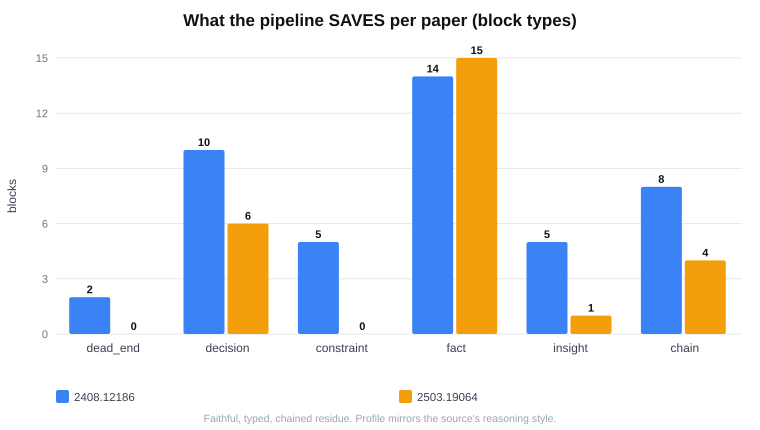

# NodeDex

A persistent knowledge graph that gives **autonomous AI agents** memory across sessions.

Without NodeDex, every session starts blank. Decisions made last week, dead ends hit last month, reasoning chains built over hours — all gone on context reset. NodeDex stores them in a local SQLite graph the agent navigates deliberately, session after session.

---

## What it is

A local knowledge graph the agent reads from. Not a note-taking tool — **the agent's memory**. The blocks are its thoughts, persisted. The relations are its understanding of how things connect.

The agent is stateless by default. NodeDex makes it stateful. The graph is the identity that survives a context reset — the LLM is just the reasoning engine that runs on top of it.

**Key properties:**
- All data stays local (`~/.nodedex/*.db`) — nothing leaves the machine
- Agent navigates deliberately — tree view first, search second
- Causal chains are first-class — every block knows what caused it
- Dead ends are permanent — failed approaches are never forgotten
- Async AI pipeline — turns raw exchanges into structured knowledge without agent overhead

---

## How it works — three actors

```
  Autonomous agent (e.g. Hermes)
        │   reads ▲                         │ each finished turn (a COPY)
        │  (MCP)  │                         ▼
        │   ┌─────┴──────────────┐   ┌──────────────┐
        └──▶│  NodeDex server    │◀──│ capture tee  │  (out-of-path, fire-and-forget)
            │  • MCP read tools  │   └──────────────┘
            │  • REST API        │
            │  • AI pipeline ────┼──▶ writes blocks / chains / links (async)
            │  • self-maintenance│   (dedup · provenance · heal)
            └─────────┬──────────┘
                      ▼
              ~/.nodedex/<your>.db   (SQLite WAL — local, bitemporal)
```

- **The agent** navigates the graph with **read-only** MCP tools (`workspace_get`, `workspace_search`, `workspace_filter`, `workspace_tree`, `workspace_stats`, …). It writes nothing.
- **The pipeline** (a server-side AI) compiles everything — facts, decisions, dead ends, insights, constraints, reasoning chains — **async**, from each captured turn. The agent never has to stop and save.
- **Capture** wires each finished turn to the server — either by routing the agent's model through NodeDex's proxy (hosted agents like Hermes) or a small out-of-path tee for agents whose loop you control (`workspace_install_capture`). NodeDex is a passive MCP server — it can't see the agent's replies on its own, so **without capture the graph stays empty** (see [Connect your agent](#connect-your-agent)).

**SQLite WAL** — a single local file, bitemporal relations (history preserved, never deleted).

---

## Setup

**Prerequisites — install these first.** The project's own commands below (`git clone`,
`npm install`, `npm run build`, `npm run dev`) are **identical on macOS, Linux, and Windows**.
What differs per OS is getting the two underlying tools installed:

| OS | Node.js ≥ 18 | C/C++ build toolchain (the native SQLite driver compiles on install) |
|---|---|---|
| **macOS** | [nodejs.org](https://nodejs.org) · or `brew install node` | `xcode-select --install` |
| **Debian/Ubuntu** | [nvm](https://github.com/nvm-sh/nvm) · or `sudo apt-get install -y nodejs npm` | `sudo apt-get install -y build-essential python3` |
| **Fedora/RHEL** | `sudo dnf install -y nodejs` | `sudo dnf install -y gcc-c++ make python3` |
| **Windows** | [nodejs.org](https://nodejs.org) · or `winget install OpenJS.NodeJS` | [VS Build Tools](https://visualstudio.microsoft.com/visual-cpp-build-tools/) → "Desktop development with C++" |

**1. Download**
```bash
git clone https://github.com/NodeDex/NodeDex-v0.1.git
cd NodeDex-v0.1
```

**2. Install the server**
```bash
cd server
npm install        # also compiles the native SQLite driver (one-time)
```
*(No separate build step in this flow — the wizard runs the server from source. `npm run
build` is only for the direct-run / stdio paths; see [Commands](#commands).)*

**3. Run the onboarding wizard**
```bash
cd ../tui
npm install
npm run dev          # first run launches the setup wizard
```

The wizard walks you through it: provider + API key → model (with a free-but-trains-on-prompts
warning where it applies) → pick a free port → create or name a database → it starts the
server on **`localhost`**. On first run it also downloads the bundled local embedding model
(one-time) so semantic search works offline with no extra key.

> Localhost is right when your agent runs on **this same machine**. If your agent runs in
> **Docker or on another machine**, use the wizard to configure your key/model, but start the
> server as shown in [Connect → *Agent in Docker / on another machine*](#connect-your-agent)
> (it needs to bind `0.0.0.0` + a token).

Embeddings default to a **bundled local model** (offline, free, no key). To use a hosted
embedder instead, put `EMBEDDING_PROVIDER=gemini` (or `openai`) in `~/.nodedex/.env` — it's a
config value, not a shell command, so it's the same on every OS. All config lives in
`~/.nodedex/` and your provider key never enters the repo. *(On Windows, `~/.nodedex` means
`C:\Users\<you>\.nodedex`.)*

**Next:** [connect your agent](#connect-your-agent) to the running server.

---

## Connect your agent

NodeDex is built for **autonomous agents** (e.g. Hermes). The onboarding wizard sets up
and starts the **server**; connecting your agent to it is your step. Two things have to
happen — and they're separate:

**1. Give the agent the tools (read side).** Register the running server with your agent host
over MCP (**Streamable-HTTP** at `/mcp`). How depends on **where your agent runs**:

### Same machine (default)
Your agent runs on this computer, so it can reach `localhost` — and the wizard already started
the server there. Point your host at the `/mcp` URL (most MCP hosts take a small JSON config):

```json
{
  "mcpServers": {
    "nodedex": { "url": "http://localhost:3001/mcp" }
  }
}
```

Or let the host **spawn it over stdio** (run `npm run build` in `server/` first):

```json
{
  "mcpServers": {
    "nodedex": {
      "command": "node",
      "args": ["/absolute/path/to/nodedex/server/scripts/nodedex-entry.mjs"]
    }
  }
}
```

CLI-style host (e.g. Hermes): `hermes mcp add nodedex --url http://localhost:3001/mcp`, then
reload its MCP connections and start a new session.

### Agent in Docker / on another machine
A containerized or remote agent **cannot** reach the host's `localhost`, so the server must
(a) bind to all interfaces and (b) be protected with a token.

**Easiest — let the TUI do it.** In the onboarding wizard's *"Where will your agent run?"* step
(or the **Servers** tab → launch → press `d`), pick **Docker / another machine**. It binds
`0.0.0.0`, generates a token, and shows you the `host.docker.internal` URL + the `Authorization`
header to give your agent.

**Or set it up manually**, from `server/`:

```bash
# macOS / Linux
NODEDEX_BIND_HOST=0.0.0.0 NODEDEX_API_TOKEN=<a-secret> PORT=3001 npm run dev
```
```powershell
# Windows PowerShell
$env:NODEDEX_BIND_HOST="0.0.0.0"; $env:NODEDEX_API_TOKEN="<a-secret>"; $env:PORT="3001"; npm run dev
```

Then point the agent at the **host** address (not `localhost`) and send the token:

```json
{
  "mcpServers": {
    "nodedex": {
      "url": "http://host.docker.internal:3001/mcp",
      "headers": { "Authorization": "Bearer <a-secret>" }
    }
  }
}
```

`host.docker.internal` reaches the host from a Docker Desktop container (on Linux Docker, add
`--add-host=host.docker.internal:host-gateway`). **Without `0.0.0.0` you get *connection
refused*; without the token the graph is reachable on your network unauthenticated.** Full
detail: [docs/how-to/connect-mcp-over-http.md](docs/how-to/connect-mcp-over-http.md).

The agent now sees the **read tools** and can traverse the graph. (The server delivers its own
usage protocol via the MCP `instructions` field — no prompt changes needed from you.)

**2. Turn on capture (write side) — required, or the graph stays empty.** NodeDex is a
*passive* MCP server: it sees tool calls, **not** your agent's replies. Something has to push
each finished turn to it. Pick the path that fits your agent:

#### (a) Hosted / sandboxed agent (Hermes, Owl, most OpenAI-compatible hosts) — route the model through NodeDex
The zero-deploy path, and the one to use if your agent runs in a container or you don't control
its code. Point your agent's **model base URL** at NodeDex's proxy: it relays each call to your
real provider unchanged (no added latency, streaming works) and captures the turn in passing.
In your agent's model/provider settings, set:
- **base URL:** `http://host.docker.internal:3001/api`  *(same machine: `http://127.0.0.1:3001/api` — use `127.0.0.1`, not `localhost`, on Windows: a `0.0.0.0`-bound server is IPv4-only and `localhost` resolves to IPv6 `::1` first)*
- **API key:** your usual provider key (e.g. OpenRouter `sk-or-…`) — forwarded untouched, never stored
- **model:** unchanged

No file to deploy, and **no NodeDex token needed** for this path (the proxy is exempt and uses
your own provider key). Works for any agent that speaks OpenAI `/chat/completions` and lets you
set a base URL.

#### (b) Agent whose code/loop you control (Agent SDK, LangChain, your own loop) — the tee
Have the agent call **`workspace_install_capture`** once; it returns a tiny out-of-path tee to
drop into your post-turn seam (it POSTs `{user, response, reasoning}` to the server). On a
**token-gated** server, set `NODEDEX_TOKEN` where the tee runs so its POSTs authenticate.

> Without one of these, the agent can *read* memory but the graph never grows.

**So you hand your agent two things, for two endpoints:**
| For | Endpoint | Credential |
|---|---|---|
| **Reading** the graph (MCP) | `…/mcp` | the **NodeDex token** (`Authorization: Bearer <token>`) — only on a Docker/token server |
| **Capturing** turns (proxy path a) | model base URL `…/api` | your **provider key** (e.g. OpenRouter) |

*(Note these are two different keys: the **NodeDex token** authenticates the MCP read connection; your **provider key** is what the proxy forwards to OpenRouter. On a same-machine localhost server, the NodeDex token isn't needed at all.)*

**Full per-host detail** (HTTP transport, Docker / `host.docker.internal`, the capture
adapter, env toggles): [docs/how-to/connect-mcp-over-http.md](docs/how-to/connect-mcp-over-http.md)
and [docs/how-to/deploying-nodedex.md](docs/how-to/deploying-nodedex.md).

---

## Reconfigure / uninstall

From `tui`:

```bash
# change your API key or model (edits ~/.nodedex/config.json)
npm run reconfigure                                  # interactive
npm run reconfigure -- --model openai/gpt-4o-mini    # or pass flags
npm run reconfigure -- --key sk-or-...               # validated before saving
```
Re-launch the server afterward to apply (TUI Servers tab → `[x]` stop, `[l]` launch).

```bash
# remove all local data + config (~/.nodedex: config, API key, databases, logs)
npm run uninstall          # asks for confirmation — this is destructive
```
Uninstall does **not** remove the code (delete the repo folder for that) or the NodeDex
entry in your agent host's MCP config (remove that on the host).

---

## Commands

**Server** (`cd server`):

| Command | What it does |
|---|---|
| `npm install` | install deps + build the native SQLite driver |
| `npm run build` | compile TypeScript → `dist/` |
| `npm run dev` | run the server from source (tsx, no build step) |
| `npm start` | run the compiled server (`dist/`, reads `.env`) |
| `npm run restart` | stop any running servers, then start fresh |
| `npm test` | run the test suite |

**Console / setup** (`cd tui`):

| Command | What it does |
|---|---|
| `npm run dev` | launch the TUI — first run is the onboarding wizard, then the operator console |
| `npm run reconfigure` | change the API key or model |
| `npm run uninstall` | remove `~/.nodedex` (data + config) |

In the TUI **Servers** tab: `[l]` launch · `[x]` stop · `[c]` change database · `[r]` rescan free ports.

> The TUI is the normal way to run the server (it configures the key/model + picks a port and
> database). The `server/` scripts above are the manual/advanced path.

---

## Block types

| Type | When it's used |
|---|---|
| `fact` | Confirmed true, specific, doesn't block future choices |
| `decision` | A choice made — could have been different |
| `constraint` | Hard external limit — blocks or narrows future choices |
| `dead_end` | Approach tried and abandoned — permanent |
| `insight` | Non-obvious realization from a single source |
| `chain` | A causal arc assembled from linked blocks (cause → outcome) |
| `blueprint` | Design decided but not yet built |
| `entity` | Named person, company, system, product |
| `process` | Step-by-step workflow with 3+ distinct steps |
| `task` | Work item — open / in_progress / done |
| `project` | Root container — the only valid orphan |

The pipeline classifies and writes these from your turns; the agent reads them.

---

## How the agent reads it

Navigate first, search second — the tree shows everything.

```
workspace_tree                     # root view — projects + counts
workspace_filter(concepts)         # cold start: concepts → relevant roots
workspace_get(label, "relations")  # a block + its causal chain(s)
workspace_search(query)            # keyword fallback
workspace_stats(agent_id)          # graph landscape + extraction freshness + pending flags
```

A block alone is a headline; its **chain** is the story — `workspace_get` returns the
named causal chain(s) the block sits on, so one read gives the whole arc.

---

## Evidence it works

We test NodeDex the way it's actually used: **extract reasoning through the pipeline → check
the graph's health → see whether the agent can traverse to what it needs** — read from the
live graph, not inferred from a score.

Feeding research-paper derivations through the pipeline, here's the **reasoning residue it
captured per paper, by block type** (read directly from the graph):



The captured profile **mirrors the source's reasoning style** — a bound-derivation paper is
*try → reject → choose → constrain* (dead-end / constraint-heavy: 53 blocks, incl. 2 dead-ends,
10 decisions, 5 constraints, 8 chains); a clean theorem proof is *establish → conclude* (fact /
chain-heavy). On a representative paper the graph was healthy — **55 blocks, only 1 flagged for
review, decisions wired to their justifying facts, zero islanded roots** — and navigating it
(tree → root → decision → chain) handed back the scoped result *with its derivation*, not a
decontextualized fragment.

> **Not a RAG pass-rate.** We deliberately don't report a one-shot benchmark score: a passive
> "retrieve-and-inject" call can't exercise traversal, so its number measures the agent's task
> skill, not the memory. Full write-up:
> [docs/NODEDEX-MEMORY-MODEL.md](docs/NODEDEX-MEMORY-MODEL.md).

Engine health: **1160/1160 server tests pass**, with extraction → graph → retrieval validated
end-to-end.

---

## Self-maintenance

The graph keeps itself clean server-side (no agent effort):
- **Detect ($0):** duplicate blocks, fabricated source quotes, schema drift.
- **Resolve:** a server-side reviewer auto-merges the clear cases; the genuinely
  ambiguous ones it can't decide are surfaced to the agent (it pulls them in
  `workspace_stats`) to confirm in plain language.

---

## Infrastructure

| Thing | Location |
|---|---|
| Database | `~/.nodedex/<your-db>.db` (SQLite WAL) |
| MCP endpoint | `http://localhost:<port>/mcp` |
| REST API | `http://localhost:<port>` |
| Config + keys | `~/.nodedex/config.json` (never committed) |

**Backup:** automatic (after reflect cycles, keeps recent snapshots in
`~/.nodedex/data/backups/`); manual via `POST /api/admin/backup`; export via `GET /api/export`.

---

## Documentation

See [docs/README.md](docs/README.md) for the full index.

| File | What it covers |
|---|---|
| `docs/how-to/connect-mcp-over-http.md` | Connect an agent over HTTP MCP |
| `docs/how-to/deploying-nodedex.md` | Deployment model (same-machine vs Docker/remote) |
| `docs/how-to/add-llm-provider.md` | Configure Gemini, OpenAI, Anthropic, OpenAI-compatible, etc. |
| `docs/reference/block-types.md` | All block types, fields, TTL |
| `docs/reference/rest-api.md` | REST endpoints |
| `docs/explanation/architecture.md` | Internals — pipeline passes, block anatomy, protocol |
| `agent.md` | The agent usage protocol (delivered to the agent via MCP `instructions`) |

---

## License

NodeDex is licensed under the **GNU AGPL-3.0** (see [LICENSE](LICENSE)). You can use,
modify, and self-host it freely. If you modify NodeDex and offer it to others over a
network, the AGPL requires you to make your modified source available under the same
license.

**Commercial license:** if you need to use NodeDex without the AGPL's copyleft obligations
— e.g. embedding it in a closed-source product, or offering it as a hosted service without
releasing your changes — a commercial license is available. Contact **nodedex.dev@gmail.com**.

Contributions are welcome under a lightweight CLA — see [CONTRIBUTING.md](CONTRIBUTING.md).
