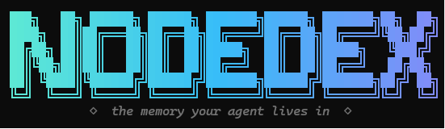

<div align="center">

# NodeDex

**your project's decision history, for agents**

Give your agent your project's **decision history**: it checks what was already **ruled out** before proposing, follows **supersede** edges to current truth instead of citing a stale decision, and inherits the whole investigation cold — session after session. Built automatically from the agent's own conversations into a local causal graph. Works with Claude Code, Cursor, Hermes, or an agent loop you wrote yourself. (A different job than your fact store — [run both](#why-nodedex).)

[Quick start](#setup) · [How it works](#how-it-works--three-actors) · [Connect your agent](#connect-your-agent) · [Why NodeDex](#why-nodedex) · [Evidence](#evidence-it-works) · [Docs](docs/README.md)

[](https://www.npmjs.com/package/nodedex)
[](LICENSE)
[](#evidence-it-works)
[](#)
[](#connect-your-agent)



<sub>An agent walking its own memory: a <b>dead-end</b> → <i>why</i> it was abandoned → the <b>causal chain</b>. The structure is the recall.</sub>

</div>

---

Without NodeDex, session N+1 quietly **re-derives what session N already settled** — which approaches failed (and why), which decisions were replaced (and by what), which constraints still bind. NodeDex keeps that record in a local SQLite graph the agent navigates deliberately, session after session.

> **Status — early & solo-built.** NodeDex is developed by one person and is at an early stage.
> The engine is tested end-to-end (1304 passing tests), but it hasn't been battle-tested across
> many machines and agents yet — **expect rough edges, and please [open an issue](https://github.com/NodeDex/NodeDex-v0.1/issues)
> when you hit one.** Feedback at this stage is hugely valuable.
>
> **Newest, and least battle-tested:** the [three-wire setup](#connect-your-agent) — your agent
> installs NodeDex into itself (reflex + capture + gate), and NodeDex verifies each wire by what
> actually happened rather than taking the agent's word. The **gate** (a pre-edit check, warn-only,
> fail-open) is brand new; it replaces a roadmap item that used to read "hook-enforced check, not
> just a nudge". Whether it changes agent behaviour on a long task is exactly what we're measuring
> next — **we don't claim it yet.**
>
> **On the roadmap:** interop with Claude Code's native memory · a "what's new since last session"
> surface · broader agent-host support.

---

## Why NodeDex

Forgetting announces itself — the agent asks again, you sigh, you re-explain. The failure that actually costs you re-work is **silent**: the agent re-proposes an approach it tried and abandoned three sessions ago, or plans against a decision that was replaced two weeks back. The stale decision looks exactly as authoritative as the current one, the ruled-out approach sounds fresh, and the hours get burned twice.

**NodeDex fixes being *confidently wrong about the past*.** That's a knowledge-*status* problem — ruled-out, superseded, still-open — and status is structure, not recall. So NodeDex keeps the project's **reasoning residue** as a graph the agent *walks*: decisions with their why and the alternatives that lost, **dead-ends** as a permanent, enumerable closed-door list the agent is taught to check first (a strong nudge, not a hard block), constraints that can't silently move, and the causal chains tying them together.

A new agent inheriting a project doesn't get a ranked pile of facts — it **walks the investigation**, and learns what *not* to repeat.

<details>
<summary><b>How is this different from mem0 / RAG / native memory?</b></summary>

Different job. Most "agent memory" stores **facts and preferences** and retrieves the top-k at query time — perfect for *"the user prefers TypeScript"*, and genuinely good at it. NodeDex captures the reasoning *around* those facts: what was tried, what was ruled out, what was decided and why.

| | a fact store (mem0 / RAG / native memory) | NodeDex |
|---|---|---|
| Stores | facts, preferences | decisions + *why*, **dead-ends**, constraints, insights |
| Links | shared-entity association | **causal** (`prompted_by → based_on → supersedes`) |
| Recall | one-shot top-k retrieval | **traverse** root → decision → why → chain |
| Failed approaches | — | **permanent dead-ends** — an enumerable closed-door list checked before proposing |

They're complementary, and many setups run both. NodeDex doesn't replace your fact store.

</details>

## When you *don't* need NodeDex

Honest scope: for short sessions, one-shot tasks, and fact-recall workflows, **native memory is good enough — skip NodeDex**, it would be overkill. It earns its keep on **long-running, decision-dense, multi-session** work where repeating a failure is expensive — and especially on **autonomous runs, where no human is watching to catch the agent re-proposing a dead end**.

---

## Try it in 60 seconds — no key, no setup

A fresh graph is empty (the value accumulates from your real work), so NodeDex ships a
sample project history you can explore immediately:

```bash
npx nodedex demo
```

That serves a small finished project — its decisions (with the why and the rejected
alternatives), its dead-ends, its constraints, and one decision that got *superseded* —
at `http://127.0.0.1:3009/mcp`. Point any MCP agent at it and ask:

1. *"What did we try and abandon in the ratelimiter project, and why?"*
2. *"Why was token bucket chosen — what else was considered?"*
3. *"Is 'keep the counters in Redis' still the current decision?"* — it isn't; watch the
   agent follow the supersede edge to current truth instead of quoting the stale one.
4. *"What's still open or unverified?"*

If those answers are useful from a 15-block toy, imagine them from six weeks of your own
work. `nodedex stop 3009` ends the demo; your real graph is never touched.

Want receipts before installing? **[Evidence it works](#evidence-it-works)** — what the
pipeline captures from real transcripts, graph health, and search that admits its limits.

---

## What it is

A local knowledge graph of what the project **established** — every decision, dead-end, constraint, and the causal links between them — persisted outside the context window and read by the agent over MCP. Not a note-taking tool: nobody curates it; a background pipeline builds it from the work itself.

The agent is stateless by default. NodeDex gives it a durable record of the project's reasoning that survives every context reset — the LLM is just the reasoning engine that runs on top of it.

**Key properties:**
- Storage is local (`~/.nodedex/*.db`). Extraction is local **or** cloud, depending on the model you pick: a cloud provider (e.g. OpenRouter) receives conversation content for extraction; a local model keeps everything on the machine. The database is plaintext unless you set `NODEDEX_DB_ENCRYPTION_KEY`.
- Agent navigates deliberately — tree view first, search second
- Causal chains are first-class — blocks carry the links that produced them (standalone records are allowed)
- Dead ends are retained by design — extraction can still miss or misclassify one; every block carries its verbatim source excerpt so you can check it
- Async AI pipeline — turns raw exchanges into structured knowledge without agent overhead

---

## How it works — three actors

```
  Autonomous agent (e.g. Hermes)
        │   reads ▲                         │ each finished turn (a COPY)
        │  (MCP)  │                         ▼
        │   ┌─────┴──────────────┐   ┌──────────────┐
        └──▶│  NodeDex server    │◀──│ capture tee  │  (out-of-path, fire-and-forget)
            │  • MCP read tools  │   └──────────────┘
            │  • REST API        │
            │  • AI pipeline ────┼──▶ writes blocks / chains / links (async)
            │  • self-maintenance│   (dedup · provenance · heal)
            └─────────┬──────────┘
                      ▼
              ~/.nodedex/<your>.db   (SQLite WAL — local, bitemporal)
```

- **The agent** navigates the graph with **read-only** MCP tools (`workspace_get`, `workspace_search`, `workspace_filter`, `workspace_tree`, `workspace_stats`, …). Knowledge-write tools are hidden by default; a read records usage metadata (access counts) on the block it opens — never content, links, or status. The one deliberate write on the default surface: `workspace_task_update` — the agent maintains **its own task status** (only the agent knows when its work is actually finished; everything else stays the pipeline's job).
- **The pipeline** (a server-side AI) compiles everything — facts, decisions, dead ends, insights, constraints, reasoning chains — **async**, from each captured turn. The agent never has to stop and save.
- **Capture** wires each finished turn to the server. The path depends on the host: **Hermes / Owl** are captured by reading their own `state.db` (they ignore a model proxy); an **OpenAI-compatible host** that honors a custom base URL can route its model through NodeDex's proxy; an agent whose **loop you control** uses a small out-of-path tee (`workspace_install_capture`). NodeDex is a passive MCP server — it can't see the agent's replies on its own, so **without capture the graph stays empty** (see [Connect your agent](#connect-your-agent)).

**SQLite WAL** — a single local file, bitemporal relations (history preserved, never deleted).

---

## Setup

**One command (Node ≥ 18):**

```bash
npx nodedex
```

First run launches the setup wizard; once configured, the same command just starts the
server. Prefer a real install? `npm i -g nodedex` puts `nodedex` on your PATH. Everything —
config, key, databases, logs — lives in `~/.nodedex/`, and `npx nodedex uninstall` removes
it all.

> **Or let your agent install it.** If you already run an agent with shell access
> (Claude Code, OpenClaw, Hermes…), paste **[AGENT-INSTALL.md](AGENT-INSTALL.md)** into it:
> the agent asks you three consent questions, runs one headless setup command, starts the
> server, and connects itself.

> **Native driver note:** the SQLite driver ships prebuilt for common platforms. Only if
> npm has to compile it from source do you need a C/C++ toolchain (macOS:
> `xcode-select --install` · Debian: `build-essential python3` · Windows:
> [VS Build Tools](https://visualstudio.microsoft.com/visual-cpp-build-tools/) → C++).

<details>
<summary><b>Install from source instead (development / contributing)</b></summary>

```bash
git clone https://github.com/NodeDex/NodeDex-v0.1.git
cd NodeDex-v0.1/server && npm install          # compiles/fetches the SQLite driver
cd ../tui && npm install
npm run dev                                    # first run launches the setup wizard
```

</details>

The wizard walks you through it: **choose your model** — **OpenRouter** (cloud, bring your key,
with a free-but-trains-on-prompts warning where it applies) or **Local / self-hosted** (Ollama /
LM Studio / vLLM — offline, no key, $0; the wizard **scans and lists your local models** so you
just pick one) → pick a free port → create or name a database → it starts the server on
**`localhost`** and, on the final screen, shows you your **server URL** (and an **auth token**
if you chose a network/Docker bind) — **save these; they're exactly what you hand your agent**
in the next step. On first run it also downloads the bundled
local *embedding* model (one-time) so semantic search works offline with no extra key.

> **The extraction model must be smart AND have a large context window** — the pipeline asks it
> to comprehend whole conversation arcs and emit strict, complete structured output, which is
> harder than chat. From real testing: a 12B local model *comprehends* fine but reliably fails
> the strict structured passes (drops mandatory items, runaway output) — the pipeline refuses
> to save the incomplete result, so you get safety but no memory. Working floor: a cheap cloud
> model (the recommended `gemini-2.5-flash-lite`, ~½¢ per extraction, 1M context) or a capable
> **~27–30B+** local model served with a **≥16k real context window** (watch Ollama's default
> `num_ctx` — imports often run at 8k regardless of what the model supports). For local runs,
> also set `NODEDEX_THINKING_BUDGET=off` and a `NODEDEX_MODEL_CAPS` entry for your model.

> The wizard sets up a **same-machine** server (localhost) — the default. Running your agent in
> **Docker or on another machine** is a later, advanced setup (bind `0.0.0.0` + a token); see
> [docs/how-to/connect-mcp-over-http.md](docs/how-to/connect-mcp-over-http.md).

Embeddings default to a **bundled local model** (offline, free, no key). To use a hosted
embedder instead, put `EMBEDDING_PROVIDER=gemini` (or `openai`) in `~/.nodedex/.env` — it's a
config value, not a shell command, so it's the same on every OS. All config lives in
`~/.nodedex/` and your provider key never enters the repo. *(On Windows, `~/.nodedex` means
`C:\Users\<you>\.nodedex`.)*

**Next:** [connect your agent](#connect-your-agent) to the running server.

---

## Connect your agent

NodeDex is built for **agentic agents doing long, multi-session work** — anything that can
read a file, write a file, and run a tool. Claude Code, Cursor, Codex, Copilot, an autonomous
host like Hermes, or a loop you wrote yourself: the setup below is the **same for all of them**,
because your agent does it, not you.

There are exactly **two steps**.

### Step 1 — point your agent at the server (the only host-specific part)

The wizard already started the server and printed your URL (`http://127.0.0.1:<port>/mcp`).
Register it with your host over MCP (Streamable-HTTP). One line, once:

| Host | How |
|---|---|
| **Claude Code (CLI)** | `claude mcp add --transport http nodedex http://127.0.0.1:3001/mcp` <br/>(add `--scope user` for every project) |
| **Claude Code in an IDE** | project `.mcp.json` → `{ "mcpServers": { "nodedex": { "type": "http", "url": "…/mcp" } } }`, then start a **new** session |
| **Cursor** | `~/.cursor/mcp.json` → `{ "mcpServers": { "nodedex": { "url": "…/mcp" } } }` |
| **VS Code / Copilot** | `.vscode/mcp.json` → top key is `"servers"`, not `"mcpServers"` |
| **Codex** | `~/.codex/config.toml` → `[mcp_servers.nodedex]` / `url = "…/mcp"` |
| **Hermes** | `hermes mcp add nodedex --url http://127.0.0.1:3001/mcp`, then restart |
| **Your own loop** | `{ "mcpServers": { "nodedex": { "url": "…/mcp" } } }` — or skip MCP entirely and call the REST API |

> **Use `127.0.0.1`, not `localhost`** — the server binds IPv4, and on Windows `localhost` resolves
> to IPv6 `::1` first, so it silently fails to connect. Lost your URL? Run **`nodedex connect`**;
> `~/.nodedex/connect-snippets.md` also holds ready-to-paste configs, regenerated at each launch.

### Step 2 — tell your agent to wire itself in

Say this to it, once:

> **Set up NodeDex**

That's the whole instruction. **Your agent installs NodeDex into itself** — it knows its own host
far better than we do, so it finds its own files and its own seams. It will ask your permission
before touching anything, and it will be **nagged on every tool result until it's done**, so it's
hard to skip.

There are **three wires**, and they have different lifetimes — which is the entire point:

| Wire | What it does | Without it |
|---|---|---|
| **CAPTURE** | feeds finished turns to the pipeline | the graph stays **empty, forever** |
| **REFLEX** | a short marked block in the file your agent re-reads **every turn** (`AGENTS.md`, `CLAUDE.md`, a rules file, a system prompt) | the habit reaches it once, at connect, and is gone from context by the time it's deep in a task |
| **GATE** | a check that fires **right before it edits a file** and reminds it to consult the graph if it hasn't looked recently | nothing checks anything at the moment that actually matters |

The **gate warns; it never blocks**, and it **fails open** — if NodeDex isn't running, it does
nothing at all. It will never stand between you and your editor.

**None of it is taken on trust.** NodeDex verifies each wire by what actually *happened* — it reads
the file back and looks for the marker, waits for a real turn to land in the graph, waits for a real
check to reach the endpoint. An agent that *says* it did the setup and didn't will keep being nagged.

<details>
<summary><b>Why three wires and not just "connect the tools"?</b></summary>

Because connecting the tools is demonstrably not enough. In our own testing, an agent with NodeDex
connected read this project's recorded dead-ends at **12:17**, wrote the code at **16:44**, and
shipped the exact bug those dead-ends warned about. It understood them perfectly — in isolation it
uses them every time. It simply no longer *had* them: the instruction to look arrived once, at
connect, and four hours and several compactions later it was gone.

A memory an agent doesn't consult at the moment of decision is not memory. The reflex puts the habit
where the host re-reads it every turn; the gate puts the reminder at the edit itself. Capture makes
sure there is something there to find.

</details>

### If your agent can't write files

Then it can't install anything, and you wire it by hand — three HTTP calls, any language:

```bash
# 1. REFLEX — paste this into that agent's system prompt (it must be present on EVERY turn)
curl http://127.0.0.1:3001/api/agent-reflex?format=text

# 2. CAPTURE — POST each finished turn, fire-and-forget, out of your model's path
#    POST /api/reflect/trigger  { user_message, agent_response, reasoning }

# 3. GATE — call before a file edit; feed anything it returns back into context
curl http://127.0.0.1:3001/api/gate/check
```

On Node, `workspace_install_capture` hands your agent a ready-made adapter (a fire-and-forget tee —
your model call is never touched or slowed) and `workspace_install_gate` hands it the gate script.

> Some hosts persist their own transcripts and expose no post-turn seam (Claude Code, Hermes). For
> those, NodeDex ships a **watcher** instead — read-only, forward-only, enabled from the TUI — so
> capture works with no wiring at all. The wizard detects them and asks.

---

**Full detail / other hosts.** Two things make it work, and they're separate:

**1. Give the agent the tools (read side).** Register the running server with your agent host
over MCP (**Streamable-HTTP** at `/mcp`). How depends on **where your agent runs**:

### Same machine (default)
Your agent runs on this computer, so it can reach the server on loopback — and the wizard already
started it there. Point your host at the `/mcp` URL (most MCP hosts take a small JSON config):

```json
{
  "mcpServers": {
    "nodedex": { "url": "http://127.0.0.1:3001/mcp" }
  }
}
```
> **Use `127.0.0.1`, not `localhost`** — the server binds IPv4, and on Windows `localhost`
> resolves to IPv6 `::1` first, so `localhost` silently fails to connect while `127.0.0.1` works.

Or let the host **spawn it over stdio** (`npm i -g nodedex` first, so the command exists
on PATH; from a clone use `node /path/to/server/scripts/nodedex-entry.mjs` instead):

```json
{
  "mcpServers": {
    "nodedex": { "command": "nodedex-server" }
  }
}
```

CLI-style host (e.g. Hermes): `hermes mcp add nodedex --url http://127.0.0.1:3001/mcp`, then
reload its MCP connections and start a new session.

**Claude Code, Cursor, VS Code — the *agent* picks the config file, not the editor.** The Claude
Code extension uses `.mcp.json` even when it runs inside Cursor or VS Code; Cursor's and VS Code's
*own* agents use their own files. Same `/mcp` URL, different location + key per agent:

| Agent | Where the config lives | Config |
|---|---|---|
| **Claude Code** (CLI) | `claude mcp add --transport http nodedex http://127.0.0.1:3001/mcp` — add `--scope user` for all projects | — |
| **Claude Code** (VS Code / JetBrains / Cursor *extension*) | project `.mcp.json` + one-time approval in `.claude/settings.local.json` | `{ "mcpServers": { "nodedex": { "type": "http", "url": "http://127.0.0.1:3001/mcp" } } }`, plus `{ "enableAllProjectMcpServers": true, "enabledMcpjsonServers": ["nodedex"] }` in settings, then start a **new** session |
| **Cursor** (Cursor's own AI) | `~/.cursor/mcp.json` (all projects) or `.cursor/mcp.json` | `{ "mcpServers": { "nodedex": { "url": "http://127.0.0.1:3001/mcp" } } }` |
| **VS Code** (Copilot agent) | `.vscode/mcp.json` | `{ "servers": { "nodedex": { "type": "http", "url": "http://127.0.0.1:3001/mcp" } } }` — note the key is `servers`, not `mcpServers` |

> **Switching hosts (e.g. Hermes → Claude Code) moves no data.** The graph is host-agnostic — every
> agent reads and feeds the *same* graph. To add or switch, just connect the new host (MCP above +
> its capture path below) and it immediately sees everything the previous one left. Run several at once if you like.

### Agent in Docker / on another machine (advanced — not first-run)
A containerized or remote agent can't reach the host's loopback, so the server must bind
`0.0.0.0` and use a token, and the agent connects via the host address (e.g.
`host.docker.internal`). That's a deliberate, later setup — full steps (bind host, token,
Docker networking) are in
[docs/how-to/connect-mcp-over-http.md](docs/how-to/connect-mcp-over-http.md).

The agent now sees the **read tools** and can traverse the graph. (The server delivers its own
usage protocol via the MCP `instructions` field — no prompt changes needed from you.)

**2. Turn on capture (write side) — required, or the graph stays empty.** NodeDex is a
*passive* MCP server: it sees tool calls, **not** your agent's replies. Something has to push
each finished turn to it. Pick the path that fits your agent:

#### (a) Watchers — zero-setup capture for hosts that persist their own turns
The lowest-friction path: NodeDex reads the host's **own conversation log** (read-only, on your
machine, forward-only — never past history) and needs nothing from the host itself. The
onboarding wizard detects installed hosts and asks which to capture; toggles live in the
**TUI's settings view**.

- **Claude Code** — tails your session transcripts (`~/.claude/projects/…jsonl`). Every session
  becomes its own arc in the graph; the `projects` row scopes which projects are captured
  (`*` = all).
- **Hermes / Owl** — reads Hermes's `state.db` (Hermes **ignores a custom model base URL** and
  never invokes its shell hooks, so this is the only path that works for it). The `sources` row
  is the privacy filter (default `tui`). Full walkthrough:
  **[docs/how-to/connect-hermes.md](docs/how-to/connect-hermes.md)**.

#### (b) OpenAI-compatible host that honors a custom base URL — route the model through NodeDex
The zero-deploy path for a host that *does* let you redirect its model endpoint (Hermes does not — use
(a)). Point your agent's **model base URL** at NodeDex's proxy: it relays each call to your real
provider unchanged (no added latency, streaming works) and captures the turn in passing. In your
agent's model/provider settings, set:
- **base URL:** `http://127.0.0.1:3001/api`  *(use `127.0.0.1`, not `localhost`, on Windows: a `0.0.0.0`-bound server is IPv4-only and `localhost` resolves to IPv6 `::1` first; a remote/Docker agent uses the host address instead)*
- **API key:** your usual provider key (e.g. OpenRouter `sk-or-…`) — forwarded untouched, never stored
- **model:** unchanged

No file to deploy, and **no NodeDex token needed** for this path (the proxy is exempt and uses
your own provider key).

#### (c) Agent whose code/loop you control (Agent SDK, LangChain, your own loop) — the tee
Have the agent call **`workspace_install_capture`** once; it returns a tiny out-of-path tee to
drop into your post-turn seam (it POSTs `{user, response, reasoning}` to the server). On a
**token-gated** server, set `NODEDEX_TOKEN` where the tee runs so its POSTs authenticate.

> Without one of these, the agent can *read* memory but the graph never grows.

**What you hand your agent depends on the path.** *Reading* is always the MCP `…/mcp` URL (plus a
token only on a Docker/network server). *Capturing* differs by host:

| Capture path | Wire up | Credential |
|---|---|---|
| **Watcher** (Claude Code, Hermes/Owl) | nothing — it reads the host's own log locally | none |
| **Proxy** (base-URL hosts) | model base URL → `…/api` | your **provider key** (forwarded to your provider) |
| **Tee** (loop you control) | `workspace_install_capture` snippet | `NODEDEX_TOKEN` only if the server is gated |

**Using Hermes / Owl?** Full end-to-end walkthrough (MCP read + the state.db watcher + every
gotcha): [docs/how-to/connect-hermes.md](docs/how-to/connect-hermes.md).

**Full per-host detail** (HTTP transport, Docker / `host.docker.internal`, the capture
adapter, env toggles): [docs/how-to/connect-mcp-over-http.md](docs/how-to/connect-mcp-over-http.md)
and [docs/how-to/deploying-nodedex.md](docs/how-to/deploying-nodedex.md).

---

## Reconfigure / uninstall

```bash
# change your key / model / provider (merges into ~/.nodedex/config.json)
npx nodedex setup --provider openrouter --key sk-or-...   # validated before saving
npx nodedex onboard                                       # or re-run the full wizard

# remove all local data + config (~/.nodedex: config, API key, databases, logs)
npx nodedex uninstall      # asks for confirmation — this is destructive
```

Or do it inside the TUI: **settings view → `provider` row** switches cloud/local and picks a
model (local models are auto-scanned). A model change within the same provider applies live;
a provider/endpoint switch applies when the server relaunches (switch db, or restart the TUI).

Uninstall does **not** remove the package (`npm rm -g nodedex` for that) or the NodeDex
entry in your agent host's MCP config (remove that on the host). *(From a clone, the same
ops are `npm run reconfigure` / `npm run uninstall` in `tui/`.)*

---

## Commands

**Server** (`cd server`):

| Command | What it does |
|---|---|
| `npm install` | install deps + build the native SQLite driver |
| `npm run build` | compile TypeScript → `dist/` |
| `npm run dev` | run the server from source (tsx, no build step) |
| `npm start` | run the compiled server (`dist/`, reads `.env`) |
| `npm run restart` | stop any running servers, then start fresh |
| `npm test` | run the test suite |

**The `nodedex` command** (from `npx nodedex` / `npm i -g nodedex`; from a clone,
`cd server && npm link` gives you the same command):

| Command | What it does |
|---|---|
| `nodedex` | first run → the setup wizard; configured → starts the server |
| `nodedex demo` | serve the bundled sample graph on :3009 — explore a finished project's memory, no key needed |
| `nodedex run` | start the server + enabled capture watchers (never interactive) |
| `nodedex tui` | launch the operator console |
| `nodedex onboard` | re-run the setup wizard (switch provider / model / port / db) |
| `nodedex setup --key … --model …` | headless setup / reconfigure — flags merge into the existing config |
| `nodedex connect` | the connection card: the right URL per client location + token rule + test commands |
| `nodedex stop [port \| --all]` | stop running NodeDex servers (confirms a NodeDex answers before killing anything) |
| `nodedex uninstall` | remove all local data + config (`~/.nodedex`) — asks first; `--yes` for scripts |
| `nodedex help` | usage |

**Console / setup** (`cd tui`):

| Command | What it does |
|---|---|
| `npm run dev` | launch the TUI — first run is the onboarding wizard, then the operator console |
| `npm run onboard` | re-run the full setup wizard (switch provider/model/port/db) even if already set up |
| `npm run reconfigure` | change just the API key or model |
| `npm run uninstall` | remove `~/.nodedex` (data + config) |

The TUI has **three views** — `1 memory` (browse roots, walk stories, `/` search),
`2 feed` (memory forming live + what the agent read), `3 health` (server/db switch, provider
+ model picker, pipeline knobs, capture toggles, review queue). Everything is a row: `↑↓`
move, `enter` acts.

> The TUI is the normal way to run the server (it configures the key/model + picks a port and
> database, and relaunches it on a db switch). The `server/` scripts above are the
> manual/advanced path.

---

## Block types

| Type | When it's used |
|---|---|
| `fact` | Confirmed true, specific, doesn't block future choices |
| `decision` | A choice made — could have been different |
| `constraint` | Hard external limit — blocks or narrows future choices |
| `dead_end` | Approach tried and abandoned — permanent |
| `insight` | Non-obvious realization from a single source |
| `chain` | A causal arc assembled from linked blocks (cause → outcome) |
| `blueprint` | Design decided but not yet built |
| `entity` | Named person, company, system, product |
| `process` | Step-by-step workflow with 3+ distinct steps |
| `task` | Work item — open / in_progress / done |
| `project` | Root container — the only valid orphan |

The pipeline classifies and writes these from your turns; the agent reads them.

---

## How the agent reads it

Navigate first, search second — the tree shows everything.

```
workspace_tree                     # root view — projects + counts
workspace_filter(concepts)         # cold start: concepts → relevant roots
workspace_get(label, "relations")  # a block + its causal chain(s)
workspace_search(query)            # fallback: semantic + keyword + concept, ranked by match
workspace_stats(agent_id)          # graph landscape + extraction freshness + pending flags
```

A block alone is a headline; its **chain** is the story — `workspace_get` returns the
named causal chain(s) the block sits on, so one read gives the whole arc.

Search is honest about its limits: every hit shows **which root it lives under** and its
match signals, superseded blocks are flagged with what replaced them, and when nothing
really matches the results say so (*weak matches only*) instead of posing as an answer.

---

## Evidence it works

We test NodeDex the way it's actually used: **extract reasoning through the pipeline → check
the graph's health → see whether the agent can traverse to what it needs** — read from the
live graph, not inferred from a score.

Feeding research-paper derivations through the pipeline, here's the **reasoning residue it
captured per paper, by block type** (read directly from the graph):


The captured profile **mirrors the source's reasoning style** — a bound-derivation paper is
*try → reject → choose → constrain* (dead-end / constraint-heavy: 53 blocks, incl. 2 dead-ends,
10 decisions, 5 constraints, 8 chains); a clean theorem proof is *establish → conclude* (fact /
chain-heavy). On a representative paper the graph was healthy — **55 blocks, only 1 flagged for
review, decisions wired to their justifying facts, zero islanded roots** — and navigating it
(tree → root → decision → chain) handed back the scoped result *with its derivation*, not a
decontextualized fragment.

> **Not a RAG pass-rate.** We deliberately don't report a one-shot benchmark score: a passive
> "retrieve-and-inject" call can't exercise traversal, so its number measures the agent's task
> skill, not the memory. Full write-up:
> [docs/NODEDEX-MEMORY-MODEL.md](docs/NODEDEX-MEMORY-MODEL.md).

Engine health: **1304/1304 server tests pass**, with extraction → graph → retrieval validated
end-to-end — including capture-loss (ack-safe watcher cursors), the MCP read surface itself
(what the agent receives, provenance included), and the setup wires (a claimed-but-unwritten
reflex is caught, not believed). Tests prove the *mechanisms* work; whether the memory makes
*your* agent measurably better is the claim we're still validating with users.

We also ran NodeDex on itself: the last ~50 turns of the Claude Code session that *built* it,
captured by the watcher, extracted into a 223-block graph — audited at 9/10 fidelity, with the
graph correctly holding its own bug-fix story (the decision, the dead-end it replaced, and the
constraints, all wired). Search on that graph: on-topic queries returned 15/15 relevant hits;
off-topic queries come back explicitly labeled *weak — the graph likely has nothing on this*
rather than posing as answers.

---

## Self-maintenance

The graph keeps itself clean server-side (no agent effort):
- **Detect ($0):** duplicate blocks, fabricated source quotes, schema drift.
- **Resolve:** a server-side reviewer auto-merges the clear cases; the genuinely
  ambiguous ones it can't decide are surfaced to the agent (it pulls them in
  `workspace_stats`) to confirm in plain language.

---

## Infrastructure

| Thing | Location |
|---|---|
| Database | `~/.nodedex/<your-db>.db` (SQLite WAL) |
| MCP endpoint | `http://localhost:<port>/mcp` |
| REST API | `http://localhost:<port>` |
| Config + keys | `~/.nodedex/config.json` (never committed) |

**Backup:** automatic (after reflect cycles, keeps recent snapshots in
`~/.nodedex/data/backups/`); manual via `POST /api/admin/backup`; export via `GET /api/export`.

---

## Documentation

See [docs/README.md](docs/README.md) for the full index.

| File | What it covers |
|---|---|
| `docs/how-to/connect-mcp-over-http.md` | Connect an agent over HTTP MCP |
| `docs/how-to/deploying-nodedex.md` | Deployment model (same-machine vs Docker/remote) |
| `docs/how-to/add-llm-provider.md` | Configure Gemini, OpenAI, Anthropic, OpenAI-compatible, etc. |
| `docs/reference/block-types.md` | All block types, fields, TTL |
| `docs/reference/rest-api.md` | REST endpoints |
| `docs/explanation/architecture.md` | Internals — pipeline passes, block anatomy, protocol |
| `agent.md` | The agent usage protocol (delivered to the agent via MCP `instructions`) |

---

## License

NodeDex is licensed under the **GNU AGPL-3.0** (see [LICENSE](LICENSE)). You can use,
modify, and self-host it freely. If you modify NodeDex and offer it to others over a
network, the AGPL requires you to make your modified source available under the same
license.

**Commercial license:** if you need to use NodeDex without the AGPL's copyleft obligations
— e.g. embedding it in a closed-source product, or offering it as a hosted service without
releasing your changes — a commercial license is available. Contact **nodedex.dev@gmail.com**.

Contributions are welcome under a lightweight CLA — see [CONTRIBUTING.md](CONTRIBUTING.md).
